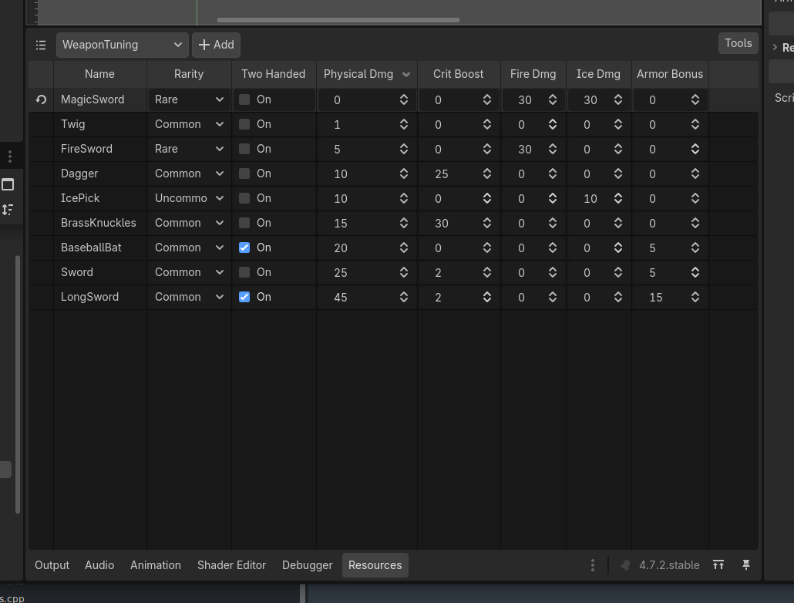

# ResourceTables

A Godot 4 GDExtension that adds a **Resources** bottom panel to the editor for browsing and editing
`Resource` instances as rows in a spreadsheet-like table, plus generators that bundle those resources
into a single table resource at build time.



## Features

- **Table editor** — pick a resource type from the dropdown and see every instance under `res://`
  (including subclasses) as a row, with one column per exported property.
- **CSV** — export a type's table to CSV and import it back.
- **Generators** — scripts that automatically write an aggregated table whenever the source resources
  change, and before builds and exports.

## Installation

1. Download the latest `ResourceTables.zip` from the [Releases](../../releases) page.
2. Extract it into your project so that `addons/ResourceTables/` sits in `res://`.
3. Enable **ResourceTables** in *Project > Project Settings > Plugins* (if listed), then reload the project.

Installation should also appear on the Godot asset store eventually.

## Usage

Open the **Resources** panel at the bottom of the editor and choose a type from the dropdown. Edit
cells in place; save with Ctrl+S or the Inspector as usual.

Your resource types must have a `class_name` assigned for them to appear!

- **Export** / **Import CSV** From the tools menu, to allow bulk editing all of your resources in an external spreadsheet

### Generators

A generator is a script extending `ResourceTableGenerator` that implements `_generate_outputs()` and
writes whatever it wants to disk. Use **Tools > New ResourceTable Generator...** to create one from
the template:

```gdscript
@tool
class_name MyItemGenerator
extends ResourceTableGenerator

func _init() -> void:
	super("MyItem")

func _generate_outputs() -> void:
	var output := ResourceTableUtils.find_or_create_resource("GenericResourceTable", "res://MyItems.tres")
	output.items = ResourceTableUtils.find_resources_of_type("MyItem")
	ResourceSaver.save(output)
```

Generators run automatically when resources of their type change, before a build, and on game export. You can write any
resource table type you want, including your own types if you want them to be strictly typed or split into multiple tables.

Generated tables should derive from `ResourceTable` to be excluded from the table view drop-down.

## API Documentation

API docs are available in the wiki, or the built-in godot documentation browser

## License

[MIT](LICENSE)
